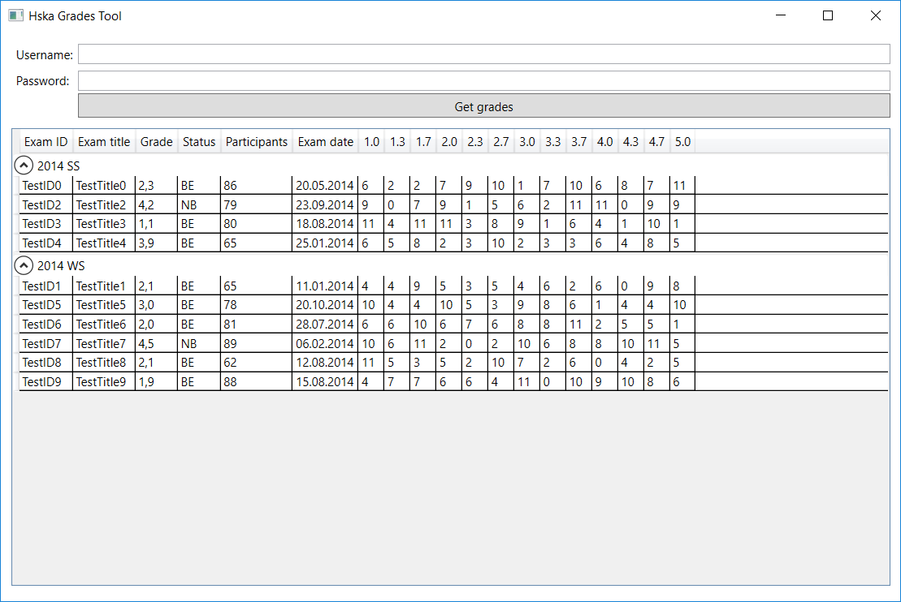

# HsKA Grades Tool

This program allows getting grade statistics from the university server of Hochschule Karlsruhe. 
The primary motivation was boredom in class. 
At some point, I started reverse engineering the SOAP requests that were generated by the 
university intranet application which led to the creation of this tool.

The codebase is absolutely terrible - blocking the UI Thread with web requests, manually building SOAP 
messages out of strings, not handling exceptions... very basic mistakes I wouldn't do today. 
The code in this repository serves as a reminder for the importance of constant self improvement.

As I don't have a student account anymore, I can't test if the tool still works. 
Pressing the "Get grades" button without a username and password generates and displays mock data.

